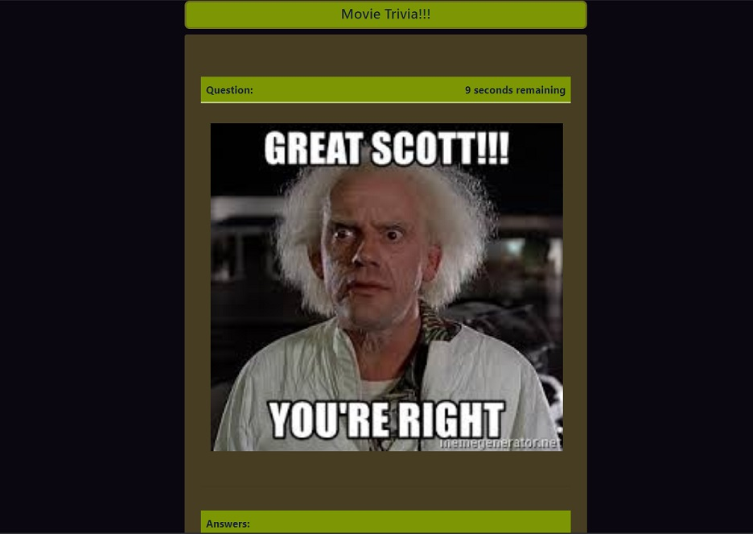

# TriviaGame

#### About:
Built with , this is a movie themed trivia game.  I created this as practice project to better learn the setTimeout/setInterval methods in Javascript.  Begin by clicking or pressing any key.  You have only a few seconds to answer the questions, so hurry up, lest you be admonished by former president Barak Obama.

[See it Live](https://akaryrye.github.io/TriviaGame/)

#### Installation:

HTTPS:   `$ Git Clone https://github.com/akaryrye/TriviaGame.git`

SSH:   `$ Git Clone git@github.com:akaryrye/TriviaGame.git`

Then, simply open index.html in your browser.

#### Technologies:
HTML, CSS, JQuery, Bootstrap

#### Author:
Ryan K Alldrin

Thank you for checking it out and I hope you enjoyed this!
